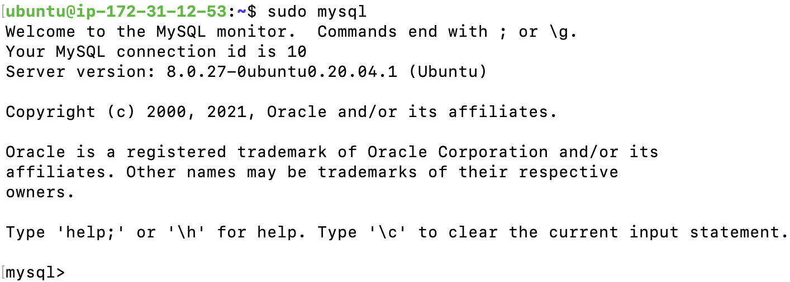
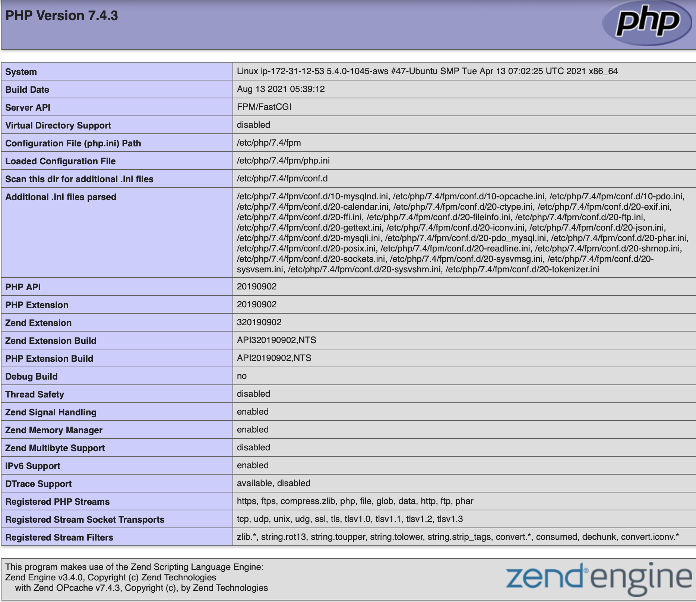
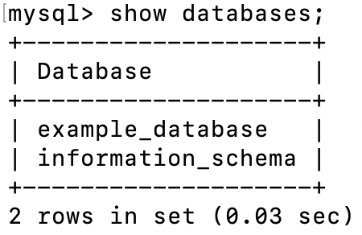
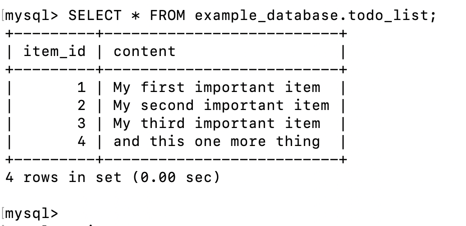
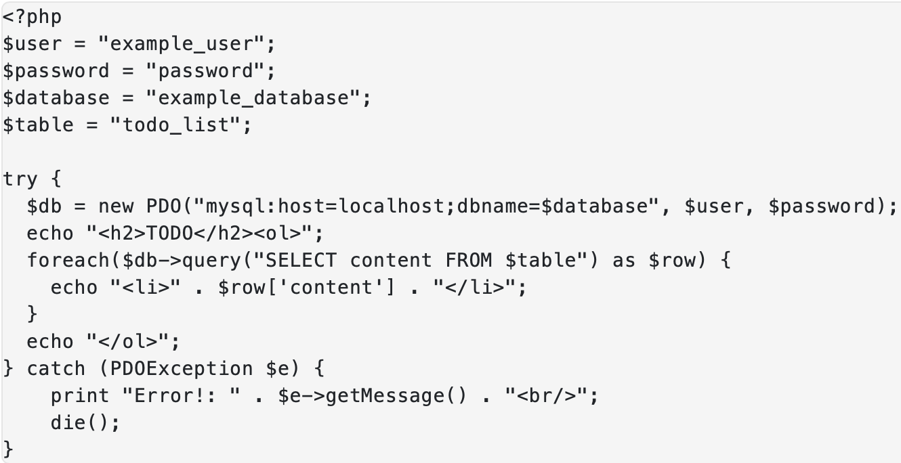
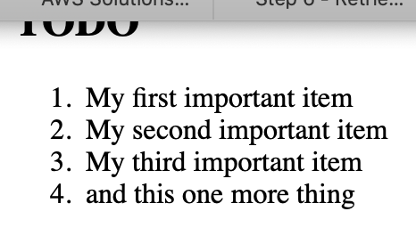

# LAMP STACK Project

- Signed into my AWS account and launched an EC2 instance of t2.micro family with Ubuntu Server 20.04 LTS (HVM)
- Connected to my EC2 instance through SSH client.

## Installing the Nginx web server

`sudo apt update`

`sudo apt install nginx` - *installed nginx*

Confirm successful installation

`sudo systemctl status nginx`

Enabled port 80 on EC2 instance for inbound connection *refer to Project-1 on how to open port 80*

Tested Ngingx on browser http://<Public-IP-Address>:80 (you may use the command `curl -s http://169.254.169.254/latest/meta-data/public-ipv4` to fetch the public ip address)

## Installing the Mysql

`sudo apt install mysql-server`

`sudo mysql_secure_installation` Validated password plugin and answered

Test installation

`sudo mysql`

Then exited MYSQL

## Installing PHP

Install 2 packages
- PHP fastCGI process manager (`php-fpm`): which tells Nginx to pass PHP requests to this software for processing and
- A PHP module (`php-mysql`) that allows PHP to communicate with MySQL-based databases

`sudo apt install php-fpm php-mysql`

## Configure Nginx to use PHP processor

`sudo mkdir /var/www/projectLEMP` - Created a new directry for my domain

`sudo chown -R $USER:$USER /var/www/projectLEMP` - assigned ownership of directory

Open up a new configuration file

`sudo nano /etc/nginx/sites-available/projectLEMP` and paste the following code

`sudo unlink /etc/nginx/sites-enabled/default` - disable default Nginx host

Reload Nginx to apply changes

`sudo systemctl reload nginx`

Created an index.html file that can be tested

`sudo echo 'Hello LEMP from hostname' $(curl -s http://169.254.169.254/latest/meta-data/public-hostname) 'with public IP' $(curl -s http://169.254.169.254/latest/meta-data/public-ipv4) > /var/www/projectLEMP/index.html`

`http://<Public-IP-Address>:80`

## Testing PHP with Nginx

Opened a new file `info.php` within document root and updated the file

`sudo nano /var/www/projectLEMP/info.php`

pasted in it:

`<?php`
`phpinfo();`

confirm page setup

`http://`server_domain_or_IP`/info.php`

Then after removed the file created which has sensitive info

`sudo rm /var/www/your_domain/info.php`

## Retrieving Data from MYSQL Database with PHP

First, connected to the MySQL console using the root account:

`sudo mysql`

Created a new database

`mysql> CREATE DATABASE `example_database`;`

Created new user with full privilegdes

`mysql>  CREATE USER 'example_user'@'%' IDENTIFIED WITH mysql_native_password BY '*****';`

`mysql> GRANT ALL ON example_database.* TO 'example_user'@'%';` - granted permission to db

Then exit MYSQL Shell and test if user has permission by logging in

`mysql> exit`

`mysql -u example_user -p`

Now confirm `example_database` database created

`mysql> SHOW DATABASES;`

Next created new table named **todo_list**

`mysql> CREATE TABLE example_database.todo_list (item_id INT AUTO_INCREMENT, content VARCHAR(255), PRIMARY KEY(item_id));`

Next inserted rows into the **todo_list** table created

`mysql> INSERT INTO example_database.todo_list (content) VALUES ("My first important item");`

Then checked rows were successfully inserted

`mysql>  SELECT * FROM example_database.todo_list;`

`mysql> exit` - exit MySQL

Next created a PHP script to connect to the MYSQL database to query the **todo_list** table

`nano /var/www/projectLEMP/todo_list.php`

paste the below into the `todo_list.php` file and save

Now accessed the page to view result on the browser by visiting the domain name or public IP address configured for your website, followed by `/todo_list.php`:

`http://<Public_domain_or_IP>/todo_list.php`

